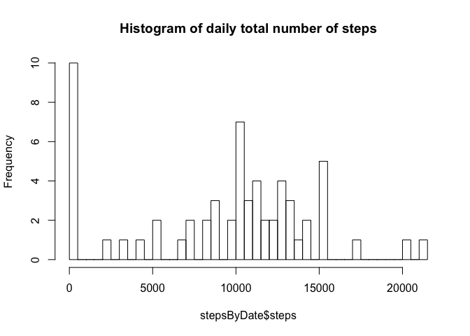
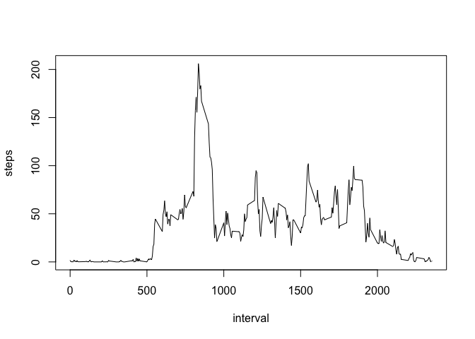
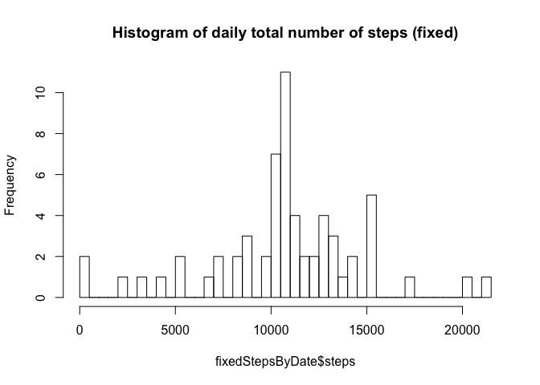
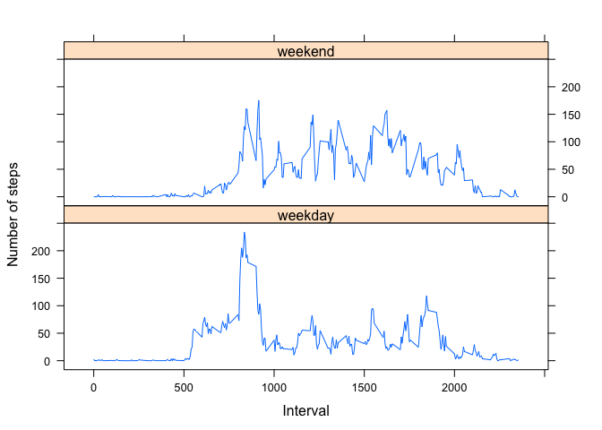

# Reproducible Research: Peer Assessment 1

## Loading the libraries

```r
knitr::opts_chunk$set(echo = TRUE)
library(dplyr)
```

```
## 
## Attaching package: 'dplyr'
```

```
## The following objects are masked from 'package:stats':
## 
##     filter, lag
```

```
## The following objects are masked from 'package:base':
## 
##     intersect, setdiff, setequal, union
```

```r
library(readr)
library(lattice)
```

## Loading and preprocessing the data

Load the data from file `activity.csv`


```r
data <- read_csv('activity.csv')
```

```
## Parsed with column specification:
## cols(
##   steps = col_integer(),
##   date = col_date(format = ""),
##   interval = col_integer()
## )
```

We don't need any preprocessing now, but we take a look at the data we got.


```r
str(data)
```

```
## Classes 'tbl_df', 'tbl' and 'data.frame':	17568 obs. of  3 variables:
##  $ steps   : int  NA NA NA NA NA NA NA NA NA NA ...
##  $ date    : Date, format: "2012-10-01" "2012-10-01" ...
##  $ interval: int  0 5 10 15 20 25 30 35 40 45 ...
##  - attr(*, "spec")=List of 2
##   ..$ cols   :List of 3
##   .. ..$ steps   : list()
##   .. .. ..- attr(*, "class")= chr  "collector_integer" "collector"
##   .. ..$ date    :List of 1
##   .. .. ..$ format: chr ""
##   .. .. ..- attr(*, "class")= chr  "collector_date" "collector"
##   .. ..$ interval: list()
##   .. .. ..- attr(*, "class")= chr  "collector_integer" "collector"
##   ..$ default: list()
##   .. ..- attr(*, "class")= chr  "collector_guess" "collector"
##   ..- attr(*, "class")= chr "col_spec"
```

As we see, some values are missing for steps.

## What is mean total number of steps taken per day?

Calculate the total number of steps taken per day


```r
stepsByDate <-
        group_by(data, date) %>%
        summarize(steps = sum(steps, na.rm=TRUE))
```

Make a histogram of the total number of steps taken each day

```r
hist(stepsByDate$steps, breaks=nrow(stepsByDate), main="Histogram of daily total number of steps")
```

<!-- -->

Calculate and report the mean and median of the total number of steps taken per day

```r
summarize(stepsByDate,
        mean = mean(steps, na.rm = TRUE),
        median = median(steps, na.rm = TRUE))
```

```
## # A tibble: 1 × 2
##      mean median
##     <dbl>  <int>
## 1 9354.23  10395
```

## What is the average daily activity pattern?

Make a time series plot of the 5-minute interval (x-axis) and the average number of steps taken, averaged across all days (y-axis)


```r
meanStepsBy5minIntervals <-
        group_by(data, interval) %>% 
        summarize(steps=mean(steps, na.rm=TRUE))

plot(meanStepsBy5minIntervals, type="l")
```

<!-- -->

Which 5-minute interval, on average across all the days in the dataset, contains the maximum number of steps?


```r
maxMeanStepsBy5minIntervals <- arrange(meanStepsBy5minIntervals, desc(steps))

maxMeanStepsBy5minIntervals[1,]
```

```
## # A tibble: 1 × 2
##   interval    steps
##      <int>    <dbl>
## 1      835 206.1698
```

## Imputing missing values

Calculate and report the total number of missing values in the dataset


```r
missingItemsCount <- sum(is.na(data$steps))
missingItemsCount
```

```
## [1] 2304
```

Fill in all of the missing values in the dataset. Replace each missing value by the mean number of steps at that interval in all days. We create a new dataset that is equal to the original dataset but with the missing data filled in.


```r
fixedData <-
        mutate(data, steps = ifelse(is.na(steps), meanStepsBy5minIntervals$steps, steps))

fixedStepsByDate <-
        group_by(fixedData, date) %>%
        summarize(steps = sum(steps))
```

Make a histogram of the total number of steps taken each day and calculate and report the mean and median total number of steps taken per day.


```r
hist(fixedStepsByDate$steps, breaks=nrow(fixedStepsByDate),
     main="Histogram of daily total number of steps (fixed)")
```

<!-- -->

```r
summarize(fixedStepsByDate,
          mean = mean(steps),
          median = median(steps))
```

```
## # A tibble: 1 × 2
##       mean   median
##      <dbl>    <dbl>
## 1 10766.19 10766.19
```

As we see, these values differ from those of the original data, repeated here:


```r
summarize(stepsByDate,
        mean = mean(steps, na.rm = TRUE),
        median = median(steps, na.rm = TRUE))
```

```
## # A tibble: 1 × 2
##      mean median
##     <dbl>  <int>
## 1 9354.23  10395
```

### Explaining the difference
Can we explain the difference?

Because we only add new values to `fixedStepsByDate`, it is clear that the sum of the total numbers of daily steps must be larger in `fixedStepsByDate` than in `stepsByDate`. The data frames `stepsByDate` and `fixedStepsByDate` have the same number of entries, one per each of the 61 different days.


```r
c(nrow(stepsByDate),nrow(fixedStepsByDate))
```

```
## [1] 61 61
```

Therefore the mean of the total numbers of daily steps must be larger `fixedStepsByDate` than in `stepsByDate`

Why is the median and mean are exactly the same in `fixedStepsByDate`?

In the original data, if data was missing for one interval in a specific day, it was missing for the whole day (288 intervals). There were eight such days.


```r
group_by(data, date) %>% 
        summarize(misscount = sum(is.na(steps))) %>%
        filter(misscount != 0)
```

```
## # A tibble: 8 × 2
##         date misscount
##       <date>     <int>
## 1 2012-10-01       288
## 2 2012-10-08       288
## 3 2012-11-01       288
## 4 2012-11-04       288
## 5 2012-11-09       288
## 6 2012-11-10       288
## 7 2012-11-14       288
## 8 2012-11-30       288
```

In `fixedStepsByDate`, the daily sums that were zero in `stepsByDate` are changed to the sum of the means of the steps in the different intervals, which is


```r
sum(meanStepsBy5minIntervals$steps)
```

```
## [1] 10766.19
```

This is also the mean of daily steps in the original data, if we drop all the dates that have missing values.


```r
filter(data, !is.na(steps)) %>%
        group_by(date) %>%
        summarize(totalSteps=sum(steps)) %>%
        summarize(mean=mean(totalSteps))
```

```
## # A tibble: 1 × 1
##       mean
##      <dbl>
## 1 10766.19
```

In `fixedStepsByDate`, we replaced the zero entries by this mean, and when we calculate the median, one of these values falls to the middle of the sorted vector and is therefore the median:


```r
sort(fixedStepsByDate$steps)
```

```
##  [1]    41.00   126.00  2492.00  3219.00  4472.00  5018.00  5441.00
##  [8]  6778.00  7047.00  7336.00  8334.00  8355.00  8821.00  8841.00
## [15]  8918.00  9819.00  9900.00 10056.00 10119.00 10139.00 10183.00
## [22] 10304.00 10395.00 10439.00 10571.00 10600.00 10765.00 10766.19
## [29] 10766.19 10766.19 10766.19 10766.19 10766.19 10766.19 10766.19
## [36] 11015.00 11162.00 11352.00 11458.00 11829.00 11834.00 12116.00
## [43] 12426.00 12608.00 12787.00 12811.00 12883.00 13294.00 13452.00
## [50] 13460.00 13646.00 14339.00 14478.00 15084.00 15098.00 15110.00
## [57] 15414.00 15420.00 17382.00 20427.00 21194.00
```

## Are there differences in activity patterns between weekdays and weekends?

Create a new factor variable in the dataset with two levels – “weekday” and “weekend” indicating whether a given date is a weekday or weekend day.


```r
data <- mutate(data, daytype = factor(ifelse (weekdays(as.Date(date)) %in% c("Saturday", "Sunday"),
                                      "weekend", "weekday")))
```

Make a panel plot containing a time series plot (i.e. type = "l") of the 5-minute interval (x-axis) and the average number of steps taken, averaged across all weekday days or weekend days (y-axis). 


```r
xyplot(steps ~ interval | daytype, type='l', layout = c(1, 2),
        ylab="Number of steps", xlab="Interval",
        data = group_by(data, interval, daytype) %>%
                     summarize(steps=mean(steps, na.rm=TRUE)))
```

<!-- -->
